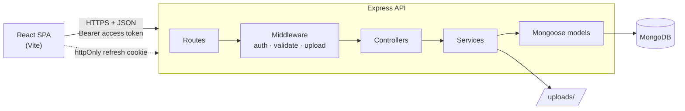

# Blogify

A full-stack blogging platform: readers can browse and search posts, and registered users can write, edit and delete their own posts and comment on others'. Built as a REST API plus a React single-page app, with an emphasis on clean architecture, security and testing rather than a long feature list.

## Tech stack

| Layer | Technology |
|---|---|
| API | Node.js, Express 5, Mongoose (MongoDB) |
| Auth | bcrypt password hashing, JWT access tokens, rotating refresh tokens in httpOnly cookies |
| Validation | Zod (request bodies, params and query strings) |
| Security | Helmet, CORS allow-list, rate limiting, upload restrictions |
| Image storage | Cloudinary in production, local disk in development (pluggable storage layer) |
| Testing | Vitest + Supertest (integration tests against a real MongoDB) |
| Frontend | React 19, React Router, Axios, Tailwind CSS, Vite |
| CI | GitHub Actions |

## Features

- Register / log in / log out with silent session renewal
- Create, read, update and delete posts (optional cover image)
- Full-text search and pagination
- Comments with owner/admin moderation
- Role-based access (`USER`, `ADMIN`) and ownership checks on every write

## Architecture



Each request flows **route → middleware → controller → service → model**:

- **Routes** declare the URL, the middleware chain and the controller.
- **Middleware** handles cross-cutting concerns: authentication, request validation, file upload, rate limiting, errors.
- **Controllers** only translate HTTP to and from function calls.
- **Services** contain the business rules (ownership checks, cascading deletes, token rotation) and can be tested without HTTP.
- **Models** define schemas, indexes and hooks.

```
server/src
├── config/        environment validation, DB connection
├── controllers/   HTTP layer
├── middlewares/   authenticate, validate, upload, rateLimit, errorHandler
├── models/        User, Blog, Comment, RefreshToken
├── routes/        route definitions
├── services/      business logic
├── utils/         AppError, tokens, permissions, logger
├── validators/    Zod schemas
├── app.js         builds the Express app (used by tests)
└── server.js      connects to the DB and starts listening
client/src
├── api/           Axios instance, token refresh interceptor, endpoint helpers
├── components/    reusable UI
├── context/       AuthContext
├── hooks/         useFetch, useDebounce
└── pages/         route-level components
```

## API

All routes are prefixed with `/api`. Successful responses are `{ data, meta? }`; errors are `{ error: { code, message, details? } }`.

| Method | Path | Auth | Description |
|---|---|---|---|
| POST | `/auth/register` | – | Create an account |
| POST | `/auth/login` | – | Log in; returns an access token and sets the refresh cookie |
| POST | `/auth/refresh` | cookie | Rotate the refresh token, issue a new access token |
| POST | `/auth/logout` | cookie | Revoke the refresh token |
| GET | `/auth/me` | access token | Current user |
| GET | `/blogs?page=&limit=&q=` | – | Paginated list, newest first; `q` performs text search |
| GET | `/blogs/:id` | – | Single post |
| POST | `/blogs` | access token | Create a post (`multipart/form-data`, optional `coverImage`) |
| PATCH | `/blogs/:id` | owner / admin | Update a post |
| DELETE | `/blogs/:id` | owner / admin | Delete a post and its comments |
| GET | `/blogs/:id/comments` | – | Paginated comments |
| POST | `/blogs/:id/comments` | access token | Add a comment |
| DELETE | `/comments/:id` | owner / admin | Delete a comment |

Status codes: `400` malformed request, `401` not authenticated, `403` not allowed, `404` not found, `409` duplicate, `422` validation failed, `429` rate limited.

## Design decisions

- **Short-lived access token + rotating refresh token.** The access token (15 min) is kept in memory by the SPA and sent as a header. The refresh token is an opaque random string in an `httpOnly` cookie scoped to `/api/auth`; only its SHA-256 hash is stored, it is single-use, and it expires via a MongoDB TTL index.
- **bcrypt with a configurable cost factor**, generic login errors to prevent account enumeration.
- **Validation at the edge with Zod.** Strict string types also block NoSQL operator injection such as `{"email": {"$ne": null}}`.
- **Central error handling.** Services throw `AppError`; one middleware converts everything (including Mongoose, Multer and JSON parse errors) to a consistent response and hides internals in production.
- **Indexed queries.** Newest-first listing, a weighted text index for search and a compound `(blog, createdAt)` index for comments. Pagination limits are capped.
- **Uploads are constrained:** MIME allow-list, size limit, server-generated filenames. Files are held in memory and only stored *after* validation and authorization pass, so rejected requests leave nothing behind. A small storage layer writes to Cloudinary when configured and to local disk otherwise.
- **The app is built by a factory (`createApp`)** so tests run against the real middleware stack without opening a port.

## Getting started

Prerequisites: Node.js 20.6+ and a running MongoDB (local or Atlas).

```bash
# 1. API
cd server
cp .env.example .env        # then set ACCESS_TOKEN_SECRET (see the comment inside)
npm install
npm run dev                 # http://localhost:5000

# 2. Web app (new terminal)
cd client
npm install
npm run dev                 # http://localhost:5173 (proxies /api and /uploads to the API)
```

### Environment variables (`server/.env`)

| Variable | Default | Purpose |
|---|---|---|
| `MONGO_URI` | – (required) | MongoDB connection string |
| `ACCESS_TOKEN_SECRET` | – (required, ≥32 chars) | Signs access tokens |
| `PORT` | `5000` | API port |
| `CLIENT_ORIGIN` | `http://localhost:5173` | Allowed CORS origin |
| `ACCESS_TOKEN_TTL` | `15m` | Access token lifetime |
| `REFRESH_TOKEN_TTL_DAYS` | `7` | Refresh token lifetime |
| `BCRYPT_ROUNDS` | `10` | bcrypt cost factor |
| `SERVE_CLIENT` | `false` | Serve the built React app from the API (single-origin deployment) |
| `COOKIE_SAMESITE` | `lax` | SameSite policy of the refresh cookie (`none` only for a cross-site frontend) |
| `CLOUDINARY_URL` | – (optional) | Store cover images on Cloudinary instead of local disk |
| `UPLOAD_DIR` / `MAX_UPLOAD_MB` | `uploads` / `2` | Local image folder and upload size limit |

## Deployment

The app deploys as **one web service**: the Express API also serves the built React app, so the browser sees a single origin. That keeps the refresh cookie first-party (`SameSite=Lax`), removes the need for CORS and avoids running two services.

```bash
npm run build   # installs deps, builds the client into client/dist, installs server production deps
npm start       # starts the API; with SERVE_CLIENT=true it also serves the SPA
```

Set `NODE_ENV=production`, `SERVE_CLIENT=true`, `MONGO_URI` (e.g. MongoDB Atlas) and a strong `ACCESS_TOKEN_SECRET` on the host. Set `CLOUDINARY_URL` so uploaded images persist (most hosts wipe local disk on restart). (If the frontend is hosted separately, set `VITE_API_ORIGIN` in `client/`, `CLIENT_ORIGIN` on the API and `COOKIE_SAMESITE=none`.)

### Demo data and admin

```bash
cd server
npm run seed                        # 2 demo users (password123), 6 posts, a few comments; safe to re-run
npm run make-admin -- alice@example.com   # promote a user to ADMIN
```

## Tests

```bash
cd server
npm test
```

The suite runs against a real MongoDB (`mongodb://localhost:27017/blogify_test` by default, override with `MONGO_URI_TEST`) and covers registration and login, refresh-token rotation and revocation, authorization (owner vs. other user vs. admin), validation errors, pagination and search, upload restrictions, the Cloudinary storage adapter (with the SDK mocked) and cascading deletes.

## Possible improvements

Refresh-token reuse detection (revoking the whole token family), object storage (S3/Cloudinary) for images, cursor-based pagination for very large feeds, Redis-backed rate limiting for multi-instance deployments, and email verification / password reset.
